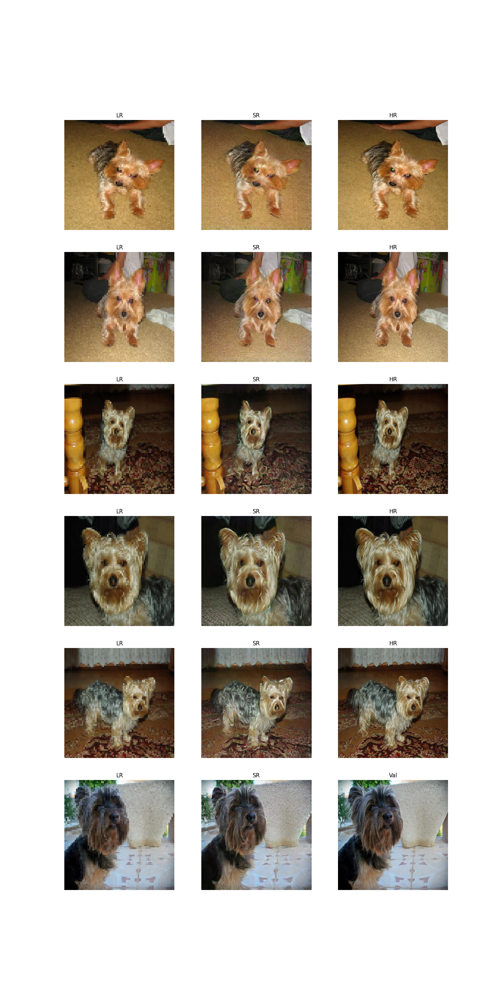
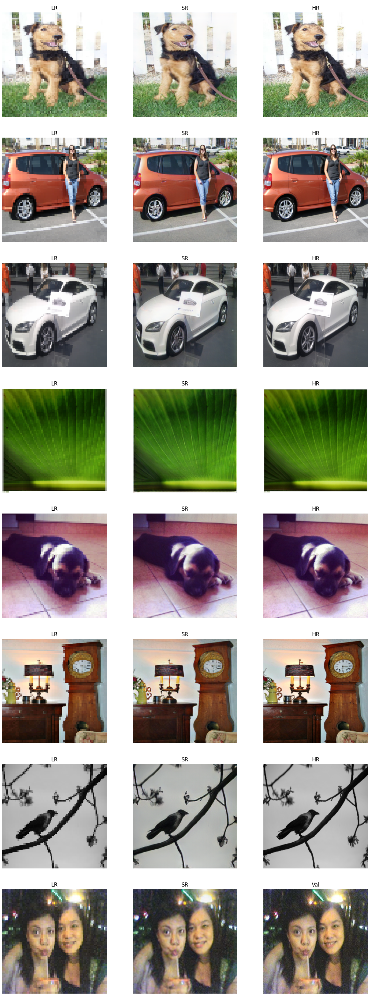
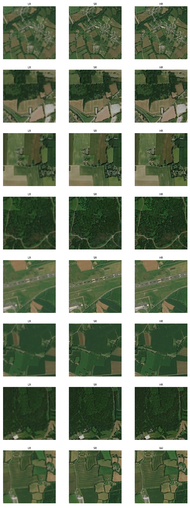
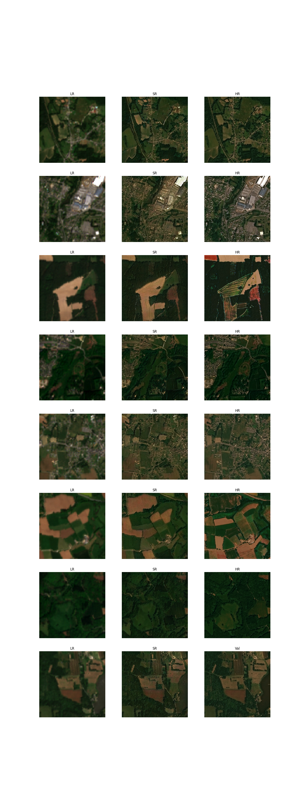
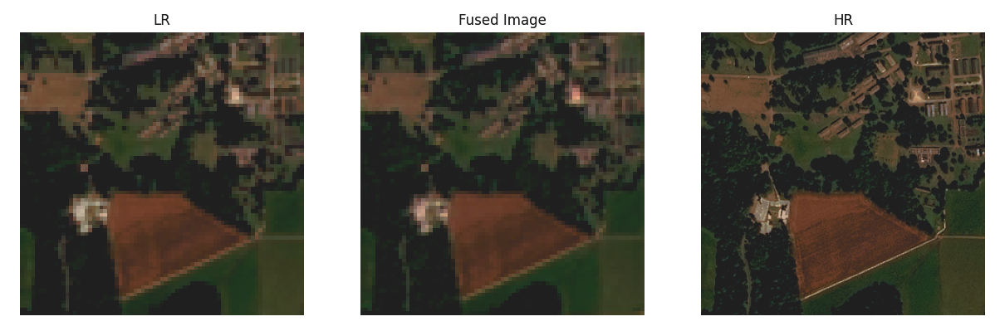
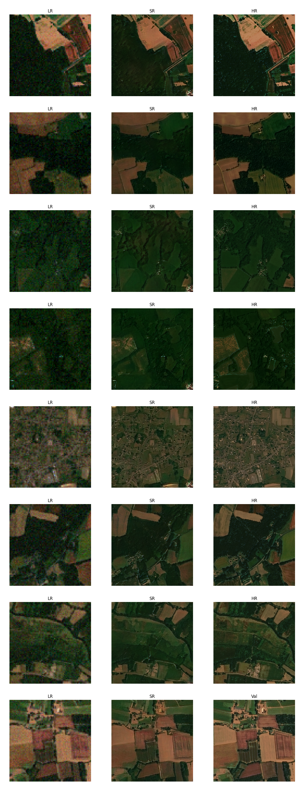
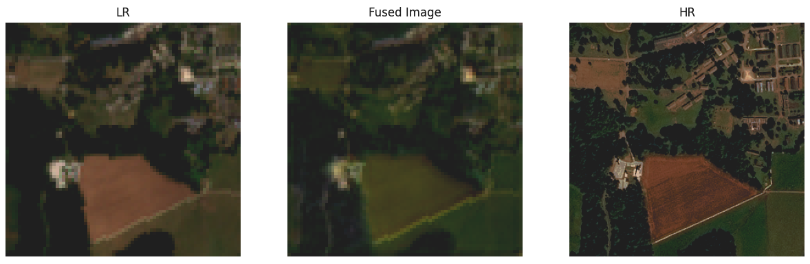
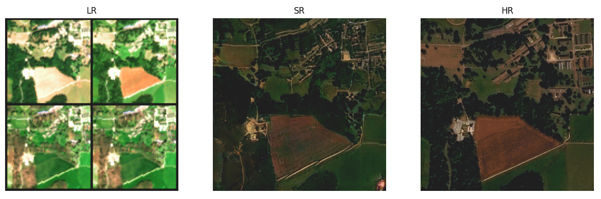
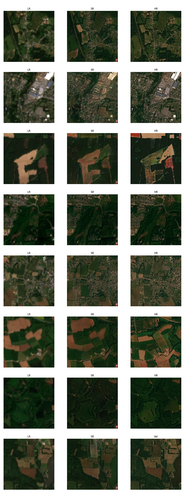

## ⚠️ Deprecation Notice
This repository is **deprecated** and no longer maintained. Please use **ESAOpenSR-SRGAN** instead → [SRGAN](https://github.com/ESAOpenSR/SRGAN)
The new repo implements **SR-GANs for remote sensing** with:
- **Flexible inputs:** any number of bands (e.g., Sentinel-2 RGB-NIR, 6-band stacks)
- - **Flexible SR factors:** ×2 / ×4 / ×8
- **Flexible architectures:** different generator and discriminator types/arcitechtures
- **Flexible losses & weights:** content/perceptual/adversarial with explicit weighting
- **Stabilized GAN training:** generator warm-up + **gradual adversarial weight ramp**
- **Whole-scene inference:** tiled processing for full Sentinel-2 SAFE tiles  
> **Note:** MISR (multi-image super-resolution) is **not supported** in the new repository.

---
# Remote Sensing SRGAN - General Info
This repository is the supplemental code of my [master's thesis](https://www.donike.net/m-sc-thesis-deep-super-resolution-of-sentinel-2-time-series/), which has been fundamentally revisited and improved. The SRGAN follows the 2017 paper by [Ledig et al.](https://arxiv.org/abs/1609.04802v5) for the fundamental GAN model, the multi-temporal fusion is inspired by HighResNet by [Deudon et al.](https://arxiv.org/abs/2002.06460)
#### Synopsis
This is an SRGAN for both Single-Image and Multi-Image Super-Resolution of Remote Sensing imagery. This model performs SR only on the RGB bands. It has been trained on SPOT-6 and Sentinel-2 image pairs and time-series of the region of Brittany in France, which means generalization of the provided checkpoints to other regions can not be guaranteed.  
With more rigorous versioning, transfer learning and LR scheduling, this workflow surpasss the results obtained in the master's thesis.
#### Performed updates copared to thesis version
- proper implementation in Pytorch Lightning, including versioning, logging, experiment tracking
- new dataloaders including stratification (by landcover), normalization, fusion warmup training
#### ToDos
- implement spatial matching (probably best via superglue algo or grid search)
- implement proper validation procedure to determine metrics for different runs on real Sen2 data

# Reproducability
## Training
Steps to train your own version:
- Install dependencies from requirements.txt. Be sure to adhere especially to the pytorch lightning version requirement, since the way of handling multiple optimizers has been removed in more recent versions.
- Define your own dataset and dataloaders. You can either use CV datasets as presented in the utils/datasets.py files, or just create your own pytorch lightning datamodule. The datamodule should return a tuple of LR (batches,views if in MISR,bands,width,height) and HR (batches,bands,width,height). Don't return the LR 'views' if in SISR mode. Change the dataset_selector function to accept and return your datamodule.
- Edit config.py with the parameters in your model, most importantly the image sizes, checkpoints, scheduler settings and dataset settings.
- run main.py file to train, automatic logging is enabled. Be sure to change the WandB settings in the train.py file for correct logging.

## Inference
The 'predict_S2_tile' performs automated Super-Resolution of a whole Sentinel-2 tile. The code in question is still under development, but operational in the context of this repo.  
Compiled in the folder *utils/sr_s2_utils*, the code creates a stacked copy of the RGB-NIR bands extracted from the .SAFE structure downloaded from Sentinel Hub. The image is iteratively super-resoved via the *predict* method of the SRGAN model, which instanciates a placeholder tif on the disk and writes the SR images into it. The images are overlapped and averaged to reduce patching artifacts. More information can be found in the docstrings of the *utils/sr_s2_utils/main* functions.

## Pretrained Weights
Download the pretrained weights [here](https://drive.google.com/drive/folders/1RcU3EQnJ7O6fYf8Zr7kqN-KCnFhsTYCa?usp=sharing) and put them in the logs/curated_ckpts folder. Check the experiments below to chose the right pretrained checkpoint for your purpose. If SR is to be performed on different regions, I strongly recommend finetuning.

# Experiment Results
## SISR
1. [Experiment 1: Oxford Dogs Dataset](#experiment-1-oxford-dogs-dataset)
2. [Experiment 2: Standard OpenAI CV Dataset](#experiment-2-standard-openai-cv-dataset)
3. [Experiment 3: SPOT6 Dataset - Interpolated Version](#experiment-3-spot6-dataset---interpolated-version)
4. [Experiment 4: SPOT6 Dataset - Interpolated Version - Stratified by Land Cover](#experiment-4-spot6-dataset---interpolated-version---stratified-by-land-cover)
5. [Experiment 5: SPOT6 Dataset - Interpolated Version - Stratified by Land Cover - Maximum Time Delta of 10 Days](#experiment-5-spot6-dataset---interpolated-version---stratified-by-land-cover---maximum-time-delta-of-10-days)
6. [Experiment 6: SPOT6 Dataset - Interpolated Version - Stratified by Land Cover - Maximum Time Delta of 10 Days - Normalization](#experiment-6-spot6-dataset---interpolated-version---stratified-by-land-cover---maximum-time-delta-of-10-days---normalization)
7. [Experiment 7: SPOT6 - Sen2 Cross Sensor Dataset](#experiment-7-spot6---sen2-cross-sensor-dataset)

## MISR
1. [Experiment 1: Fusion Warm-Up](#experiment-1-fusion-warmup)
2. [Experiment 2: MISR interpolated SPOT6](#experiment-2-misr-interpolated-spot6)
3. [Experiment 3: MISR on real Sentinel-2 time series](#experiment-3-misr-on-real-sentinel-2-time-series)

## Logging
Follow all runs on [WandB](https://wandb.ai/simon-donike/2023_SRGAN).

# Experiments: SISR
## Experiment 1: Oxford Dogs Dataset
#### Description
Initial test to confirm the capabilities of the SRGAN model. performed on a small dataset for fast iteration.
#### PSNR and SSIM Results
| Metric | Value |
| ------ | ----- |
| PSNR   | 30.01 |
| SSIM   | 0.690 |
#### Results
Good results given the small dataset. Overfitting due to low variance in dataset, but clearly SR is performed.
#### Tracking
tracking via this WandB run: [Run](https://wandb.ai/simon-donike/2023_SRGAN/runs/sk01q4zl)
#### Example Validation Image

## Experiment 2: Standard OpenAI CV dataset
#### Description
Further testing on CV camera imagery, this time on a large dataset.
#### PSNR and SSIM Results
| Metric | Value |
| ------ | ----- |
| PSNR   | 24.06 |
| SSIM   | 0.718 |
#### Results
Very good results. Some halucinations, but generally realistic appearance.
#### Tracking
tracking via this WandB run: [Run](https://wandb.ai/simon-donike/2023_SRGAN/runs/61amatk9)
#### Example Validation Image

## Experiment 3: SPOT6 Dataset - Interpolated Version
#### Description
First test on remote sensing imagery. Uses SPOT6 as the HR and an interpolated version as the LR.
#### PSNR and SSIM Results
| Metric | Value |
| ------ | ----- |
| PSNR   | 23.80 |
| SSIM   | 0.500 |
#### Results
Very good results. Comapratively low PSNR and SSIM can be explained by the switch to the remote sensing dataset. SR works well for agricultural and rural areas, but can not generalize to more urban areas and larger roads such as highways are made to look like unpaved paths.
## Tracking
tracking via this WandB run: [Run]([https://wandb.ai/simon-donike/2023_SRGAN/runs/61amatk9](https://wandb.ai/simon-donike/2023_SRGAN/runs/frimsoll))
#### Example Validation Image

## Experiment 4: SPOT6 Dataset - Interpolated Version - Stratiefied Data by Land Cover Classification
#### Description
Continued training from Experiment 3 checkpoint. The data has now been stratified in order to prevent the overrepresentation of agricultural images. 
#### PSNR and SSIM Results
| Metric | Value |
| ------ | ----- |
| PSNR   | 23.68 |
| SSIM   | 0.538 |
#### Results
Improved results comapred to experiment 3. Stratification helped to better SR urban areas. Generally realistic appearance.
#### Tracking
tracking via this WandB run: [Run](https://wandb.ai/simon-donike/2023_SRGAN/runs/eqjj87uc)
#### Example Validation Image

## Experiment 5: SPOT6 Dataset - Interpolated Version - Stratiefied Data by Land Cover Classification - Maximum Time Delta of 10 days
#### Description
Continued training from Experiment 4 checkpoint. The dataset has been further reduced to only include LR-HR pairs that were taken 10 or less days apart. Another important change is that the reflectance has been converted to the Sen2 spectral response by histogram matching the SPOT6 LR and HR versions to fit the histogram of the real Sen2 image. This model has not been trained to convergence and can only serve as a test.
#### PSNR and SSIM Results
| Metric | Value |
| ------ | ----- |
| PSNR   | 33.60 |
| SSIM   | 0.830 |
#### Results
Improved results comapred to experiment 4. Removal of larger time difference between LR and HR as well as the transformation to the Sen2 Spectrum lead to a significant increase in performance metrics. Note: The value range is now 0..1 in 10000 Sen2 steps instead of the 8bit 0..255 steps in the previous runs. This significantly improves the PSNR especially.
#### Tracking
tracking via this WandB run: [Run](https://wandb.ai/simon-donike/2023_SRGAN/runs/d1svvufy)
#### Example Validation Image

## Experiment 6: SPOT6 Dataset - Interpolated Version - Stratiefied Data by Land Cover Classification - Maximum Time Delta of 10 days - Normalization
#### Description
Continued training from Experiment 4 checkpoint. Now, the data is linearilly srtetched by dividing by 3000 in the Sen2 spectrum, then transformed to -1..+1.
#### PSNR and SSIM Results
| Metric | Value |
| ------ | ----- |
| PSNR   | 29.93 |
| SSIM   | 0.695 |
#### Results
Slightly worse results.
#### Tracking
tracking via this WandB run: [Run](https://wandb.ai/simon-donike/2023_SRGAN/runs/xptuptpr)
#### Example Validation Image

## Experiment 7: SPOT6 - Sen2 Cross Sensor Dataset
#### Description
Continued training from Experiment 6 Checkpoint.  
The previous augmentations are kept:
- Histogram Matching from SPOT6 to Sen2
- Stratification by Land Cover
- Removal of images where time delta < 5
- Normalization by /3000 and transformation to -1..+1 value range
#### PSNR and SSIM Results
| Metric | Value |
| ------ | ----- |
| PSNR   | 29.54 |
| SSIM   | 0.754 |
#### Results
Exceptional results given the cross-sensor approach. Improvements from stratification, nornalization and time delta removals hold true for this experiment as well.
#### Tracking
tracking via this WandB run: [Run](https://wandb.ai/simon-donike/2023_SRGAN/runs/7knnqsis)
#### Example Validation Image

# Experiments: MISR
## Experiment 1: Fusion Warmup
#### Description
The MISR workflow contains a small network in order to recursively fuse the multiple revisits. If instanciated randomly, the network outputs nonsensical encodings, which prevent the generator from creating proper SR images. Since both the generator and the fusion network are trained in the same loss, a randomly instanciated fusion network never returns proper encodings and therefore prevents the generator from training as well.  
In order to enable the output of sensical images, the fusion network is pretrained. Several copies of the LR tensor are created on the fly and a small amount of random gaissian noise is added to each of the revisits. The fused network is then compared to the mean of the LR revisits. This leads to the fusion network outputting a mean image of the LR time series in the image space. This encoding can then be used to train the fusion and generator together.
#### Results
The output of the converged fusion network is the mean of the input images, which is it's intended purpose in this warmup stage.
#### Tracking
tracking via this WandB run: [Run](https://wandb.ai/simon-donike/2023_SRGAN/runs/eqrsdz60)
#### Example Validation Image
This image shows the first acquisition of the time series (left), the fused image (middle), and the HR image (right).

## Experiment 2: MISR interpolated SPOT6
#### Description
in this experiment, the same data is used as in the fusion warm up. Interpolated SPOT6 data, in the Sentinel-2 spectral domain, copied 4 times with added noise to simulate the time series.
#### Results
tbd
#### Tracking
tracking via this WandB run: [Run](https://wandb.ai/simon-donike/2023_SRGAN/runs/7ldju4hr)
#### Example Validation Image
Even though noise was added, we see good results from the syhntetic MISR revisits. Especially visible in this run is the problematic SR of urban images, where more rural textures are pasted especially in suburban areas.

## Experiment 3: MISR on real Sentinel-2 time series
#### Description
A real Sentinel-2time series is used, with the same dataset modifications as in the SISR runs (normalized according to Sen-2 conventional stretch, time-delta of 1st image >3 removed, stratified by land use). Continued training on the checkpoint from MISR experiment 2.
#### Results
Description coming soon.  
First Impressions: Fusion does not work as intended, since now it has to deal with geographically shifted time series images. Since the fusion isn't ideal, the output SR is blurred.
#### Tracking  
tracking via this WandB run: [Run](https://wandb.ai/simon-donike/2023_SRGAN/runs/7n38sxlr)
#### Example Validation Image

Visualization of Fusion image, which is what is actually inputted into the SRGAN model  
  
Visualisation of LR time series, SR result, and HR reference.  
  
Result.  
 
