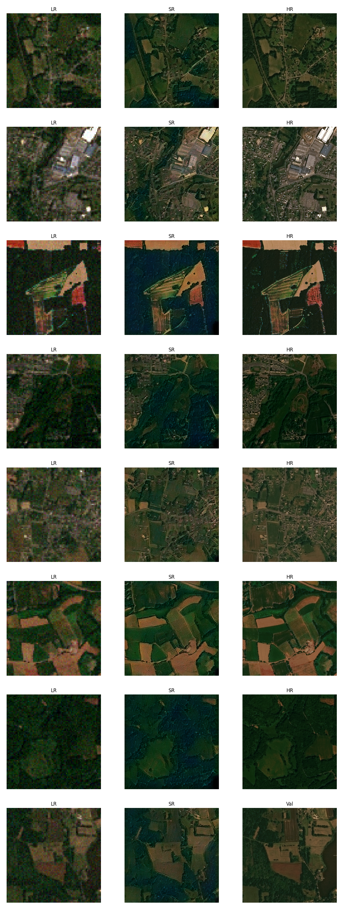

# Remote Sensing SRGAN
This repository is a revised version of my [master's thesis](https://www.donike.net/m-sc-thesis-deep-super-resolution-of-sentinel-2-time-series/).
#### Performed updates copared to thesis version
- implementation in pytorch Lightning, including versioning, logging, experiment tracking
- new dataloaders including stratification (by landcover), normalization
#### ToDos
- implement spatial matching (probably best via superglue algo or grid search)
- implement MISR
- implement proper validation procedure to determine metrics for different runs on real Sen2 data
- potentially include NIR band in SR

# Experiment Results
## SISR
1. [Experiment 1: Oxford Dogs Dataset](#experiment-1-oxford-dogs-dataset)
2. [Experiment 2: Standard OpenAI CV Dataset](#experiment-2-standard-openai-cv-dataset)
3. [Experiment 3: SPOT6 Dataset - Interpolated Version](#experiment-3-spot6-dataset---interpolated-version)
4. [Experiment 4: SPOT6 Dataset - Interpolated Version - Stratified by Land Cover](#experiment-4-spot6-dataset---interpolated-version---stratified-by-land-cover)
5. [Experiment 5: SPOT6 Dataset - Interpolated Version - Stratified by Land Cover - Maximum Time Delta of 10 Days](#experiment-5-spot6-dataset---interpolated-version---stratified-by-land-cover---maximum-time-delta-of-10-days)
6. [Experiment 6: SPOT6 Dataset - Interpolated Version - Stratified by Land Cover - Maximum Time Delta of 10 Days - Normalization](#experiment-6-spot6-dataset---interpolated-version---stratified-by-land-cover---maximum-time-delta-of-10-days---normalization)
7. [Experiment 7: SPOT6 - Sen2 Cross Sensor Dataset](#experiment-7-spot6---sen2-cross-sensor-dataset)

## MISR
1. [Experiment 1: Fusion Warm-Up](#experiment-1-fusion-warmup)

# Experiments: SISR
## Experiment 1: Oxford Dogs Dataset
#### Description
Initial test to confirm the capabilities of the SRGAN model. performed on a small dataset for fast iteration.
#### PSNR and SSIM Results
| Metric | Value |
| ------ | ----- |
| PSNR   | 30.01 |
| SSIM   | 0.690 |
#### Results
Good results given the small dataset. Overfitting due to low variance in dataset, but clearly SR is performed.
#### Tracking
tracking via this WandB run: [Run](https://wandb.ai/simon-donike/2023_SRGAN/runs/sk01q4zl)
#### Example Image

## Experiment 2: Standard OpenAI CV dataset
#### Description
Further testing on CV camera imagery, this time on a large dataset.
#### PSNR and SSIM Results
| Metric | Value |
| ------ | ----- |
| PSNR   | 24.06 |
| SSIM   | 0.718 |
#### Results
Very good results. Some halucinations, but generally realistic appearance.
#### Tracking
tracking via this WandB run: [Run](https://wandb.ai/simon-donike/2023_SRGAN/runs/61amatk9)
#### Example Image

## Experiment 3: SPOT6 Dataset - Interpolated Version
#### Description
First test on remote sensing imagery. Uses SPOT6 as the HR and an interpolated version as the LR.
#### PSNR and SSIM Results
| Metric | Value |
| ------ | ----- |
| PSNR   | 23.80 |
| SSIM   | 0.500 |
#### Results
Very good results. Comapratively low PSNR and SSIM can be explained by the switch to the remote sensing dataset. SR works well for agricultural and rural areas, but can not generalize to more urban areas and larger roads such as highways are made to look like unpaved paths.
## Tracking
tracking via this WandB run: [Run]([https://wandb.ai/simon-donike/2023_SRGAN/runs/61amatk9](https://wandb.ai/simon-donike/2023_SRGAN/runs/frimsoll))
#### Example Image

## Experiment 4: SPOT6 Dataset - Interpoalted Version - Stratiefied Data by Land Cover Classification
#### Description
Continued training from Experiment 3 checkpoint. The data has now been stratified in order to prevent the overrepresentation of agricultural images. 
#### PSNR and SSIM Results
| Metric | Value |
| ------ | ----- |
| PSNR   | 23.68 |
| SSIM   | 0.538 |
#### Results
Improved results comapred to experiment 3. Stratification helped to better SR urban areas. Generally realistic appearance.
#### Tracking
tracking via this WandB run: [Run](https://wandb.ai/simon-donike/2023_SRGAN/runs/eqjj87uc)
#### Example Image

## Experiment 5: SPOT6 Dataset - Interpoalted Version - Stratiefied Data by Land Cover Classification - Maximum Time Delta of 10 days
#### Description
Continued training from Experiment 4 checkpoint. The dataset has been further reduced to only include LR-HR pairs that were taken 10 or less days apart. Another important change is that the reflectance has been converted to the Sen2 spectral response by histogram matching the SPOT6 LR and HR versions to fit the histogram of the real Sen2 image. This model has not been trained to convergence and can only serve as a test.
#### PSNR and SSIM Results
| Metric | Value |
| ------ | ----- |
| PSNR   | 33.60 |
| SSIM   | 0.830 |
#### Results
Improved results comapred to experiment 4. Removal of larger time difference between LR and HR as well as the transformation to the Sen2 Spectrum lead to a significant increase in performance metrics. Note: The value range is now 0..1 in 10000 Sen2 steps instead of the 8bit 0..255 steps in the previous runs. This significantly improves the PSNR especially.
#### Tracking
tracking via this WandB run: [Run](https://wandb.ai/simon-donike/2023_SRGAN/runs/d1svvufy)
#### Example Image

## Experiment 6: SPOT6 Dataset - Interpoalted Version - Stratiefied Data by Land Cover Classification - Maximum Time Delta of 10 days - Normalization
#### Description
Continued training from Experiment 4 checkpoint. Now, the data is linearilly srtetched by dividing by 3000 in the Sen2 spectrum, then transformed to -1..+1.
#### PSNR and SSIM Results
| Metric | Value |
| ------ | ----- |
| PSNR   | 29.93 |
| SSIM   | 0.695 |
#### Results
Slightly worse results.
#### Tracking
tracking via this WandB run: [Run](https://wandb.ai/simon-donike/2023_SRGAN/runs/xptuptpr)
#### Example Image

## Experiment 7: SPOT6 - Sen2 Cross Sensor Dataset
#### Description
Continued training from Experiment 6 Checkpoint.  
The previous augmentations are kept:
- Histogram Matching from SPOT6 to Sen2
- Stratification by Land Cover
- Removal of images where time delta < 5
- Normalization by /3000 and transformation to -1..+1 value range
#### PSNR and SSIM Results
| Metric | Value |
| ------ | ----- |
| PSNR   | 29.54 |
| SSIM   | 0.754 |
#### Results
Exceptional results given the cross-sensor approach. Improvements from stratification, nornalization and time delta removals hold true for this experiment as well.
#### Tracking
tracking via this WandB run: [Run](https://wandb.ai/simon-donike/2023_SRGAN/runs/7knnqsis)
#### Example Image

# Experiments: MISR
## Experiment 1: Fusion Warmup
#### Description
The MISR workflow contains a small network in order to recursively fuse the multiple revisits. If instanciated randomly, the network outputs nonsensical encodings, which prevent the generator from creating proper SR images. Since both the generator and the fusion network are trained in the same loss, a randomly instanciated fusion network never returns proper encodings and therefore prevents the generator from training as well.  
In order to enable the output of sensical images, the fusion network is pretrained. Several copies of the LR tensor are created on the fly and a small amount of random gaissian noise is added to each of the revisits. The fused network is then compared to the mean of the LR revisits. This leads to the fusion network outputting a mean image of the LR time series in the image space. This encoding can then be used to train the fusion and generator together.
#### Results
The output of the converged fusion network is the mean of the input images, which is it's intended purpose in this warmup stage.
#### Tracking
tracking via this WandB run: [Run](https://wandb.ai/simon-donike/2023_SRGAN/runs/eqrsdz60)
#### Example Image
This image shows the first acquisition of the time series (left), the fused image (middle), and the HR image (right).

## Experiment 2: MISR interpolated SPOT6
#### Description
in this experiment, the same data is used as in the fusion warm up. Interpolated SPOT6 data, in the Sentinel-2 spectral domain, copied 4 times with added noise to simulate the time series.
#### Results
tbd
#### Tracking
tracking via this WandB run: [Run](https://wandb.ai/simon-donike/2023_SRGAN/runs/7ldju4hr)
#### Example Image
Still training...  

## Experiment 3: MISR on real Sentinel-2 time series
#### Description
A real Sentinel-2time series is used, with the same dataset modifications as in the SISR runs (normalized according to Sen-2 conventional stretch, time-delta of 1st image >3 removed, stratified by land use).
#### Results
tbd
#### Tracking
tracking via this WandB run: [Run]()
#### Example Image
Still training...  

