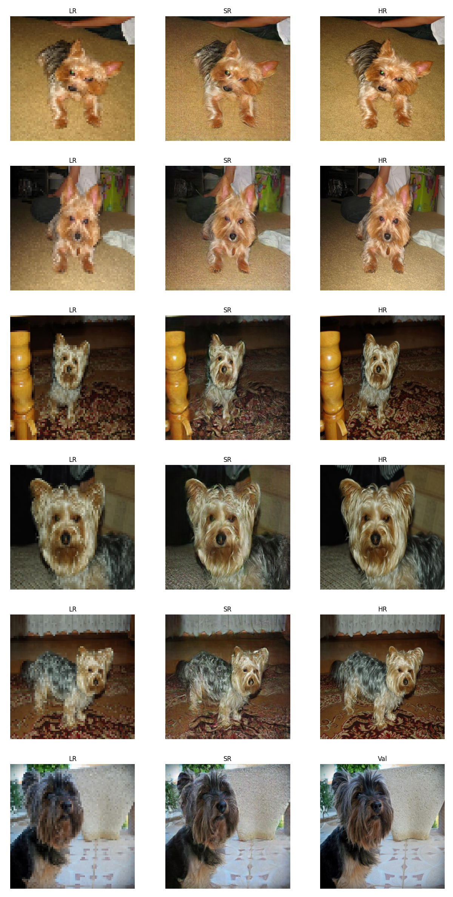
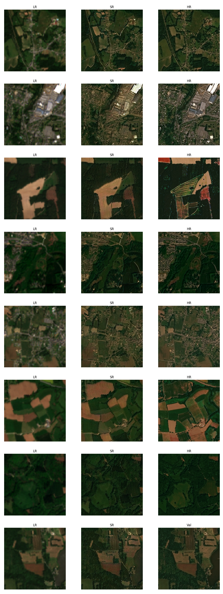

# Revision of SRGAN
### Performed updates copared to thesis version
- implementation in pytorch Lightning, including versioning, logging, experiment tracking
- new dataloaders including stratification (by landcover), normalization
### ToDos
- implement spatial matching (probably best via superglue algo or grid search)
- implement MISR
- implement proper validation procedure to determine metrics for different runs on real Sen2 data

# Experiment Results
1. [Experiment 1: Oxford Dogs Dataset](#experiment-1-oxford-dogs-dataset)
2. [Experiment 2: Standard OpenAI CV Dataset](#experiment-2-standard-openai-cv-dataset)
3. [Experiment 3: SPOT6 - Interpolated Version](#experiment-3-spot6-dataset---interpolated-version)
4. [Experiment 4: SPOT6 - Interpolated Version - Stratified by Land Cover](#experiment-4-spot6-dataset---interpolated-version---stratified-data-by-land-cover-classification)
5. [Experiment 5: SPOT6 Dataset - Interpolated Version - Stratified by Land Cover - Maximum Time Delta of 10 Days](#experiment-5-spot6-dataset---interpolated-version---stratified-data-by-land-cover-classification---maximum-time-delta-of-10-days)
6. [Experiment 6: SPOT6 - Interpolated Version - Stratified by Land Cover - Maximum Time Delta of 10 Days - Normalization](#experiment-6-spot6-dataset---interpolated-version---stratified-data-by-land-cover-classification---maximum-time-delta-of-10-days---normalization)
7. [Experiment 7: SPOT6 - Sen2 Cross Sensor Dataset](#experiment-7-spot6---sen2-cross-sensor-dataset)

## Experiment 1: Oxford Dogs Dataset
#### Description
Initial test to confirm the capabilities of the SRGAN model. performed on a small dataset for fast iteration.
#### PSNR and SSIM Results
| Metric | Value |
| ------ | ----- |
| PSNR   | 30.01 |
| SSIM   | 0.690 |
#### Results
Good results given the small dataset. Overfitting due to low variance in dataset, but clearly SR is performed.
#### Example Image

#### Tracking
tracking via this WandB run: [Run](https://wandb.ai/simon-donike/2023_SRGAN/runs/sk01q4zl)

## Experiment 2: Standard OpenAI CV dataset
#### Description
Further testing on CV camera imagery, this time on a large dataset.
#### PSNR and SSIM Results
| Metric | Value |
| ------ | ----- |
| PSNR   | 24.06 |
| SSIM   | 0.718 |
#### Results
Very good results. Some halucinations, but generally realistic appearance.
#### Example Image

#### Tracking
tracking via this WandB run: [Run](https://wandb.ai/simon-donike/2023_SRGAN/runs/61amatk9)

## Experiment 3: SPOT6 Dataset - Interpolated Version
#### Description
First test on remote sensing imagery. Uses SPOT6 as the HR and an interpolated version as the LR.
#### PSNR and SSIM Results
| Metric | Value |
| ------ | ----- |
| PSNR   | 23.80 |
| SSIM   | 0.500 |
#### Results
Very good results. Comapratively low PSNR and SSIM can be explained by the switch to the remote sensing dataset. SR works well for agricultural and rural areas, but can not generalize to more urban areas and larger roads such as highways are made to look like unpaved paths.
#### Example Image

## Tracking
tracking via this WandB run: [Run]([https://wandb.ai/simon-donike/2023_SRGAN/runs/61amatk9](https://wandb.ai/simon-donike/2023_SRGAN/runs/frimsoll))

## Experiment 4: SPOT6 Dataset - Interpoalted Version - Stratiefied Data by Land Cover Classification
#### Description
Continued training from Experiment 3 checkpoint. The data has now been stratified in order to prevent the overrepresentation of agricultural images. 
#### PSNR and SSIM Results
| Metric | Value |
| ------ | ----- |
| PSNR   | 23.68 |
| SSIM   | 0.538 |
#### Results
Improved results comapred to experiment 3. Stratification helped to better SR urban areas. Generally realistic appearance.
#### Example Image

#### Tracking
tracking via this WandB run: [Run](https://wandb.ai/simon-donike/2023_SRGAN/runs/eqjj87uc)

## Experiment 5: SPOT6 Dataset - Interpoalted Version - Stratiefied Data by Land Cover Classification - Maximum Time Delta of 10 days
#### Description
Continued training from Experiment 4 checkpoint. The dataset has been further reduced to only include LR-HR pairs that were taken 5 or less days apart. Another important change is that the reflectance has been converted to the Sen2 spectral response by histogram matching the SPOT6 LR and HR versions to fit the histogram of the real Sen2 image. This model has not been trained to convergence and can only serve as a test.
#### PSNR and SSIM Results
| Metric | Value |
| ------ | ----- |
| PSNR   | 33.60 |
| SSIM   | 0.830 |
#### Results
Improved results comapred to experiment 4. Removal of larger time difference between LR and HR as well as the transformation to the Sen2 Spectrum lead to a significant increase in performance metrics. Note: The value range is now 0..1 in 10000 Sen2 steps instead of the 8bit 0..255 steps in the previous runs. This significantly improves the PSNR especially.
#### Example Image

#### Tracking
tracking via this WandB run: [Run](https://wandb.ai/simon-donike/2023_SRGAN/runs/d1svvufy)

## Experiment 6: SPOT6 Dataset - Interpoalted Version - Stratiefied Data by Land Cover Classification - Maximum Time Delta of 10 days - Normalization
#### Description
Continued training from Experiment 4 checkpoint. Now, the data is linearilly srtetched by dividing by 3000 in the Sen2 spectrum, then transformed to -1..+1.
#### PSNR and SSIM Results
| Metric | Value |
| ------ | ----- |
| PSNR   | 29.93 |
| SSIM   | 0.695 |
#### Results
Lower results.
#### Example Image

#### Tracking
tracking via this WandB run: [Run](https://wandb.ai/simon-donike/2023_SRGAN/runs/xptuptpr)

## Experiment 7: SPOT6 - Sen2 Cross Sensor Dataset
#### Description
Continued training from Experiment 6 Checkpoint.  
The previous augmentations are kept:
- Histogram Matching from SPOT6 to Sen2
- Stratification by Land Cover
- Removal of images where time delta < 5
- Normalization by /3000 and transformation to -1..+1 value range
#### PSNR and SSIM Results
| Metric | Value |
| ------ | ----- |
| PSNR   | 29.54 |
| SSIM   | 0.754 |
#### Results
Exceptional results given the cross-sensor approach. Improvements from stratification, nornalization and time delta removals hold true for this experiment as well.
#### Example Image

#### Tracking
tracking via this WandB run: [Run](https://wandb.ai/simon-donike/2023_SRGAN/runs/7knnqsis)

